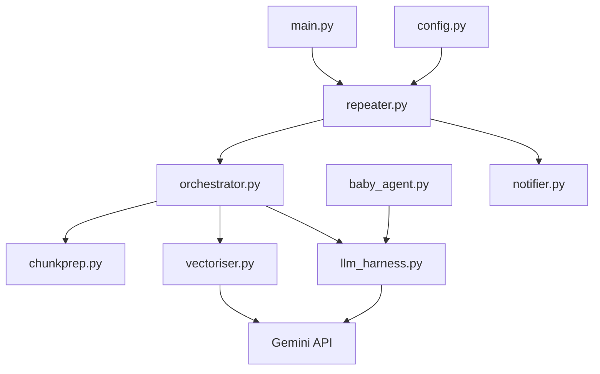

# AI Pair Engineer

An automated code-review assistant that works alongside developers to detect design flaws, propose tests, and suggest refactors. It periodically scans a target codebase, retrieves the most relevant context with embeddings, and sends structured feedback to the terminal and (optionally) your Windows desktop.

---

## Features

- **Periodic codebase monitoring** — re-analyze on a configurable interval (default: every 40 seconds)
- **Retrieval-augmented review** — chunks source files, embeds them with Gemini, and retrieves the most relevant sections before prompting the LLM
- **Structured engineering output** — design risks, test proposals, and refactoring suggestions
- **Gemini SDK integration** — uses `google-genai` for embeddings and generation, with automatic model fallbacks and retries
- **Windows desktop notifications** — toast alerts after each analysis cycle (enabled by default on Windows)
- **Single-run mode** — `--once` for ad-hoc reviews without a background loop

---

## Architecture



### Lifecycle

1. **`main.py`** starts the **repeater**, passing CLI arguments and configuration.
2. **`repeater.py`** runs analysis on a schedule (or once with `--once`). After each cycle it prints results and optionally triggers a desktop notification.
3. **`orchestrator.py`** coordinates the pipeline for a given codebase path.
4. **`chunkprep.py`** walks the target directory, filters source files, and splits them into overlapping line-based chunks.
5. **`vectoriser.py`** embeds chunks with Gemini and stores vectors **in memory** for cosine-similarity search.
6. **`llm_harness.py`** retrieves the top-k relevant chunks and sends them to Gemini with the AI Pair Engineer system prompt from **`baby_agent.py`**.
7. Results are printed to the terminal and surfaced via **`notifier.py`** when notifications are enabled.

> **Note:** Vectors are currently held in RAM for the duration of each run. They are not persisted to disk or an external database. See `database.py` for planned future storage integration.

---

## Project Structure

```
CareemAIChallenge/
├── main.py           # CLI entry point
├── repeater.py       # Scheduled execution wrapper
├── orchestrator.py   # Pipeline coordinator
├── chunkprep.py      # Codebase chunking
├── vectoriser.py     # In-memory vector store + retrieval
├── llm_harness.py    # Gemini generation with retries/fallbacks
├── baby_agent.py     # Mission statement and system prompt
├── notifier.py       # Windows desktop notifications
├── config.py         # Shared configuration
├── database.py       # Reserved for future vector persistence (e.g. Pinecone)
├── requirements.txt
├── .env.example
└── ReadMe.md
```

---

## Prerequisites

- Python 3.10+
- A [Gemini API key](https://aistudio.google.com/apikey)
- Windows (optional, for desktop toast notifications)

---

## Installation

```bash
git clone <repository-url>
cd CareemAIChallenge
pip install -r requirements.txt
```

Create a `.env` file from the example:

```bash
cp .env.example .env
```

Set your credentials:

```env
GEMINI_API_KEY=your_gemini_api_key_here
GEMINI_MODEL=gemini-3.1-flash-lite
```

---

## Usage

### Continuous monitoring (default)

Analyzes immediately, then every 40 seconds. Desktop notifications are on by default on Windows.

```bash
python main.py C:\path\to\your\codebase
```

### Single analysis run

```bash
python main.py C:\path\to\your\codebase --once
```

### Custom interval

```bash
python main.py C:\path\to\your\codebase --interval 600
```

### Disable desktop notifications

```bash
python main.py --no-notify
```

---

## CLI Reference

| Argument | Default | Description |
|----------|---------|-------------|
| `codebase_path` | *(required)* | Directory to analyze |
| `--interval` | `40` | Seconds between analysis cycles |
| `--once` | off | Run one cycle and exit |
| `--notify` / `--no-notify` | on (Windows) | Desktop notification after each cycle |
| `--model` | `GEMINI_MODEL` env or `gemini-3.1-flash-lite` | Gemini model for analysis |
| `--embedding-model` | `gemini-embedding-001` | Gemini model for embeddings |
| `--top-k` | `12` | Number of chunks sent to the LLM |

---

## Configuration

Environment variables (via `.env`):

| Variable | Description |
|----------|-------------|
| `GEMINI_API_KEY` | Required. Your Gemini API key |
| `GEMINI_MODEL` | LLM model name (default: `gemini-3.1-flash-lite`) |

Additional settings live in `config.py` — ignored directories, file extensions, chunk size, fallback models, and retry behaviour.

---

## Output

Each cycle produces an **AI Pair Engineer Report** in the terminal covering:

1. **Design flaws and architectural risks**
2. **Concrete test proposals**
3. **Refactoring suggestions with rationale**

When notifications are enabled, a truncated summary is also shown as a Windows toast.

---

## Troubleshooting

### `429 RESOURCE_EXHAUSTED` or quota errors

Your API key may not have free-tier access to the selected model. Try:

```bash
python main.py --once --model gemini-3.1-flash-lite
```

The harness automatically retries and falls back to alternate models when rate-limited or unavailable.

### `GEMINI_API_KEY is not set`

Ensure `.env` exists in the project root with a valid key, or export the variable in your shell.

### Notifications not appearing

- Confirm Focus Assist / Do Not Disturb is off on Windows
- Run without `--no-notify`
- Keep the terminal process running while monitoring

---

## Roadmap

- [ ] Persistent vector storage (`database.py` — Pinecone or similar)
- [ ] Incremental re-indexing when only changed files differ
- [ ] Cross-platform notification support

---
